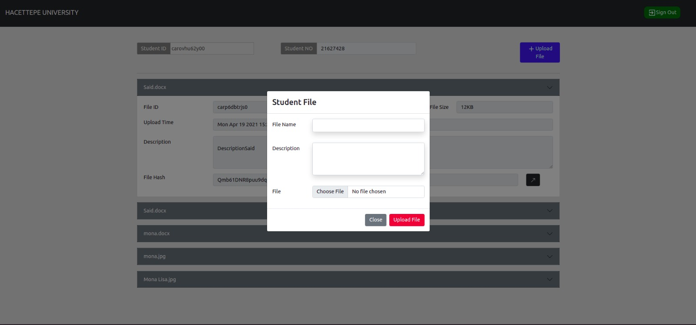
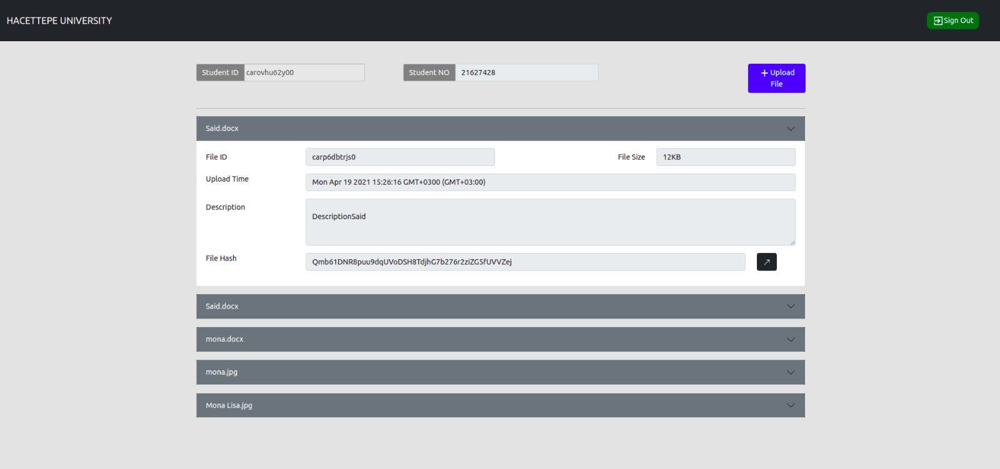
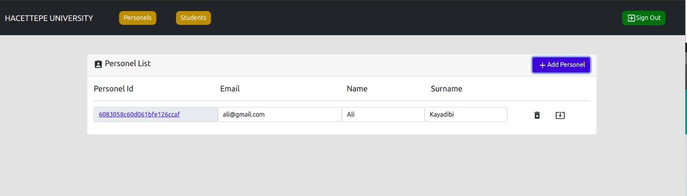
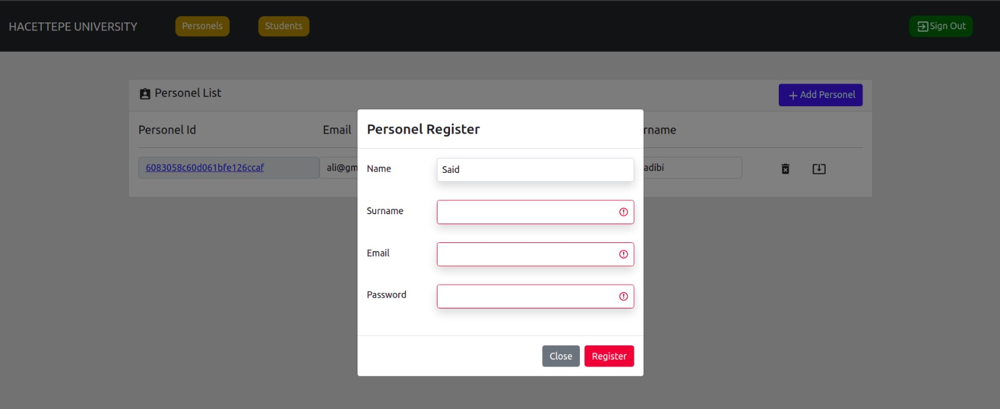
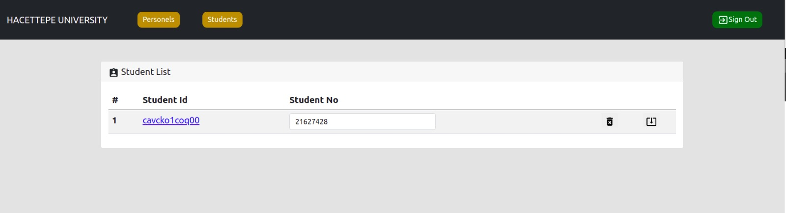

# Technologies
Solidity-Smart Contract  
IPFS-File Storage  
Ganache-Local Ethereum Network  
Truffle-Smart Contract Migration  
Web3-Ethereum Provider  

MongoDB- NoSQL Database  
ExpressJS-Rest Web Service  
ReactJS-Client  

# Usecases
1. Personel Register/Login/Update/Delete/Listing   
2. Student  Add/Update/Delete/Listing   
3. File Upload   

# Implementation Process
1. Smart Contract was written.  
2. Smart Contract was migrated to Ganache Network by using Truffle framework  
3. Single Contract instance created by Web3.js on Rest Web Service  
4. Token based authentication created.  
5. Personel informations stored on MongoDB Cloud.  
6. Client application created with React.js   

